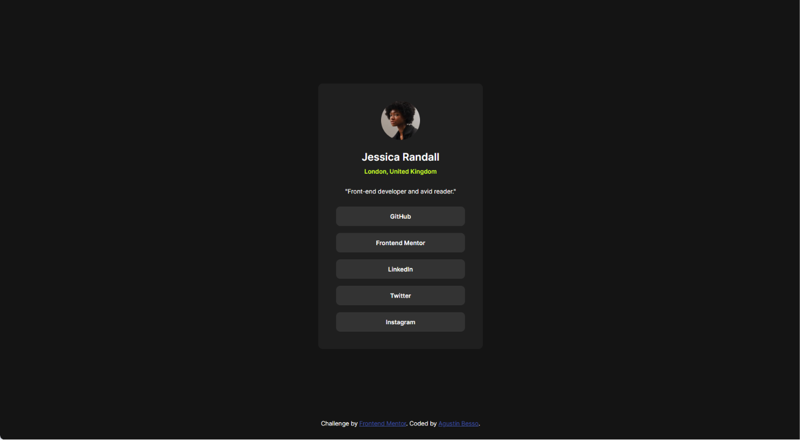

# Frontend Mentor - Social links profile solution

This is a solution to the [Social links profile challenge on Frontend Mentor](https://www.frontendmentor.io/challenges/social-links-profile-UG32l9m6dQ). Frontend Mentor challenges help you improve your coding skills by building realistic projects. 

## Table of contents

- [Overview](#overview)
  - [The challenge](#the-challenge)
  - [Screenshot](#screenshot)
  - [Links](#links)
- [My process](#my-process)
  - [Built with](#built-with)
  - [What I learned](#what-i-learned)
  - [Continued development](#continued-development)
  - [Useful resources](#useful-resources)
  - [AI Collaboration](#ai-collaboration)
- [Author](#author)

## Overview

### The challenge

Users should be able to:

- See hover and focus states for all interactive elements on the page
- View the optimal layout for the site depending on their device's screen size
- Be redirected to the social media links upon clicking the links

### Screenshot



### Links

- Solution URL: [GitHub Solution URL](https://github.com/bessoAgustin/social-links-profile-main.git)
- Live Site URL: [GitHub Pages live site URL](https://bessoagustin.github.io/social-links-profile-main/)

## My process

### Built with

- Semantic HTML5 markup
- CSS custom properties
- Flexbox
- Mobile-first workflow
- Custom fonts

### What I learned

In this project, I deepened my understanding of responsive design and how to effectively use Flexbox to create layouts that adapt to different screen sizes. I also learned how to implement hover and focus states for interactive elements, enhancing the user experience, and ensuring they are redirected to the correct social media links.
I also learned the way to declare fonts that are found locally in the repository directly in my CSS file:
```css
@font-face {
    font-family: 'Inter';
    src: url(assets/fonts/static/Inter-Regular.ttf);
    font-weight: 400;
    font-display: swap;
}
```
By declaring the font in this way, I ensured that the font is loaded from the local assets folder, which can improve performance and reliability. On the other hand, I also learned how to use the `font-display: swap;` property, which allows the browser to display a fallback font until the custom font is fully loaded, preventing invisible text during loading.

Also, I worked with color variables in CSS, which allowed me to maintain a consistent color scheme throughout the project and easily make changes to the color palette if needed.

```css
:root{
    --color-white: hsl(0, 0%, 100%);
    --color-green: hsl(75, 94%, 57%);
    --color-gray-700: hsl(0, 0%, 20%);
    --color-gray-800: hsl(0, 0%, 12%);
    --color-gray-900: hsl(0, 0%, 8%);
    --color-attrBlue: hsl(228, 45%, 44%);
}
```
### Continued development

For future projects, I would like to explore more advanced CSS techniques, such as CSS Grid, to create even more complex and responsive layouts. Additionally, I plan to improve my JavaScript skills to add interactivity and dynamic content to my web pages.

### Useful resources

- [Kevin Powell's CSS video library on YouTube](https://www.youtube.com/kevinpowell) - Kevin's content is really structured and helpful and it's helping me incorporate CSS best practices into every project.
- [PerfectPixel's Chrome Extension](https://chromewebstore.google.com/detail/dkaagdgjmgdmbnecmcefdhjekcoceebi?utm_source=item-share-cb) - This tool was useful for comparing the design with the implementation and ensuring pixel-perfect accuracy since I didn't have access to the Figma files this time.

### AI Collaboration

I used Gemini only at times when I felt stuck or needed a second opinion on how to approach a problem. I used it to get suggestions for CSS properties and layout techniques, but I made sure to understand the suggestions and implement them myself. I also used it to review my code and provide feedback on potential improvements.
It's true that, on ocasions, suggestions made my solution better, but I also found that some suggestions were not applicable to my specific project or did not align with my design vision. Overall, I found AI collaboration to be a helpful tool in my development process, but I made sure to use it as a supplement to my own knowledge and skills.

## Author

- Frontend Mentor - [@bessoagustin](https://www.frontendmentor.io/profile/bessoagustin)
- X - [@agustinbesso](https://x.com/agustinbesso)